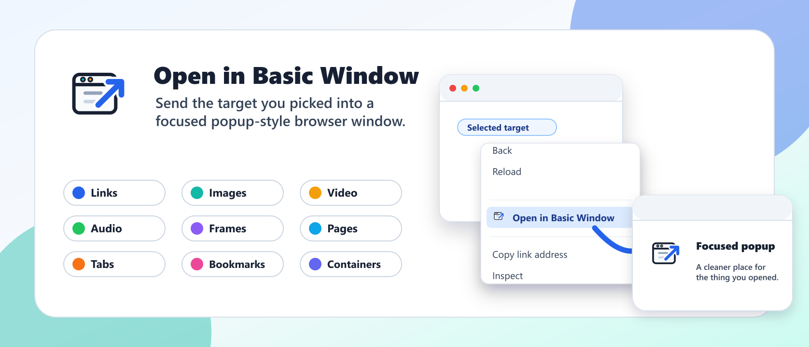

# Open in Basic Window

[![Chrome Web Store][chrome-image-store]][chrome-url] [![Microsoft Edge Add-ons][edge-image-store]][edge-url] [![Firefox Add-ons][firefox-image-store]][firefox-url]



Open in Basic Window gives your right-click menu a simple escape hatch: send the thing you selected into a focused popup-style browser window instead of another normal tab.

It is handy for keeping a reference page beside your work, popping out media, separating a frame or page from a crowded tab strip, or opening a supported bookmark without rearranging your whole browser session. Everything runs locally in your browser, with no analytics, tracking, or data collection.

Browser support varies by platform. Chrome and Edge support links, images, videos, audio, frames, pages, and tabs. Firefox supports those contexts plus bookmarks and contextual (container) identities.

## Supported Contexts

- Links
- Images
- Videos
- Audio
- Frames
- Pages
- Tabs
- Firefox bookmarks

Firefox builds preserve the source tab's contextual identity when the clicked item is tied to a tab and Firefox exposes a `cookieStoreId`. Chrome and Edge builds support the same tab/page/media/link/frame behavior, but do not support Firefox contextual identities.

## Privacy

This extension does not collect, store, transmit, or sell user data. All behavior happens locally through browser extension APIs.

See [PRIVACY.md](PRIVACY.md) for the full privacy policy.

## Permissions

- `contextMenus` / `menus`: Add the right-click menu item.
- `tabs`: Read the source tab URL and preserve tab context when opening a popup window.
- `bookmarks` in Firefox: Resolve bookmark URLs for Firefox bookmark context-menu support.
- `cookies` and `contextualIdentities` in Firefox: Preserve Firefox container identity for supported source tabs.

See [docs/permission-justifications.md](docs/permission-justifications.md) for store-review-ready permission details.

## Development

Install dependencies:

```sh
npm install
```

Run a development build:

```sh
npm run dev:chrome
npm run dev:edge
npm run dev:firefox
```

Create production builds:

```sh
npm run build:chrome
npm run build:edge
npm run build:firefox
```

Create extension ZIPs:

```sh
npm run zip:chrome
npm run zip:edge
npm run zip:firefox
```

Generated WXT files are written to `.wxt/`, and build artifacts are written to `.output/`. Both directories are intentionally ignored by git.

[chrome-url]: https://chromewebstore.google.com/detail/open-in-basic-window/kplohddcajpgkdgdnjgkcaddmcdihbjn
[chrome-image-store]: https://img.shields.io/badge/Chrome%20Web%20Store-store-4285f4?logo=googlechrome&style=for-the-badge
[edge-url]: https://microsoftedge.microsoft.com/addons/detail/open-in-basic-window/lgjbddojadnfkmodoggeiceipknajjgj
[edge-image-store]: https://img.shields.io/badge/Microsoft%20Edge%20Add--ons-store-0078d7?logo=microsoftedge&style=for-the-badge
[firefox-url]: https://addons.mozilla.org/firefox/addon/open-in-basic-window/
[firefox-image-store]: https://img.shields.io/badge/Firefox%20Add--ons-store-ff7139?logo=firefox&style=for-the-badge
